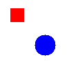

# PointerPro Animate

PointerPro Animate is a small C animation library for building simple frame-based 2D animations. It provides an opaque public API for canvases, sprites, sprite placement, layer ordering, and basic motion using velocity and acceleration.



## Project Layout

```text
.
├── include/animate.h       # Public API
├── src/                    # Library implementation
├── tests/                  # Unit tests and test runner
├── demo.c                  # Demo program that writes raw animation frames
├── assets/demo.png         # Example visual output
└── Makefile                # Build, demo, clean, and test targets
```

## Build

Build the relocatable object used by the project:

```sh
make
```

This creates `animate.o`. The Makefile may also create temporary archive/object files during the build; generated files such as `animate.a`, `*.o`, demo binaries, and raw frame files are ignored by Git.

Clean build outputs:

```sh
make clean
```

## Run The Demo

Build and run the demo:

```sh
make test
```

The demo creates a 100x100 canvas with a moving red rectangle and a blue circle, then writes raw BGRA frames named `frame_00.raw` through `frame_09.raw`, plus `frame_final.raw`.

To convert the raw frames into a video with ffmpeg:

```sh
ffmpeg -f rawvideo -pix_fmt bgra -s 100x100 -r 10 -i frame_%02d.raw -c:v libx264 -y animation.mp4
```

## Run Tests

Run the full unit test suite:

```sh
bash tests/run_all_tests.sh
```

The test runner builds `animate.o`, compiles each test with AddressSanitizer, runs the canvas, sprite, placement, and frame tests, then removes the test executables.

## API Overview

The public API is declared in `include/animate.h`. The main workflow is:

1. Create a canvas with `animate_create_canvas`.
2. Create sprites with `animate_create_rectangle`, `animate_create_circle`, or `animate_create_sprite`.
3. Place sprites on the canvas with `animate_place_sprite`.
4. Adjust layer order or animation parameters as needed.
5. Allocate a frame buffer with `animate_frame_size_bytes`.
6. Generate frames with `animate_generate_frame`.
7. Destroy placements, sprites, and canvases when finished.

Sprites are reference-counted by placements. `animate_destroy_sprite` returns `false` while a sprite is still placed on a canvas and returns `true` after it can be safely freed.
